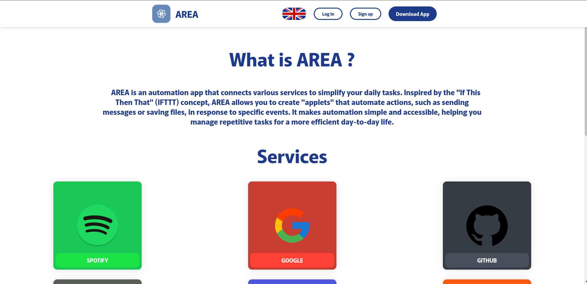
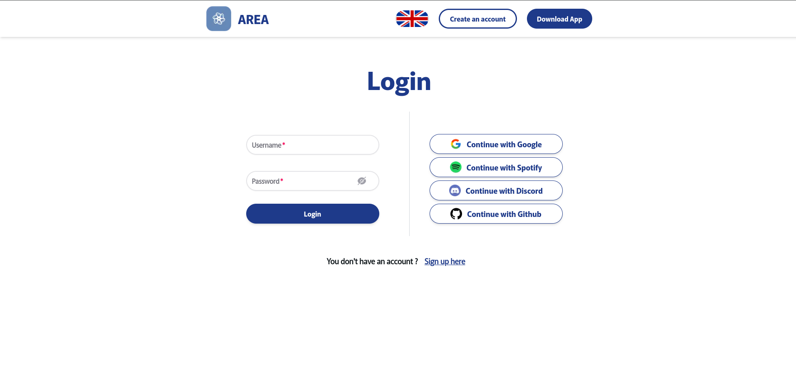
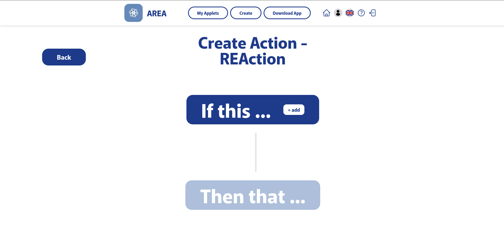
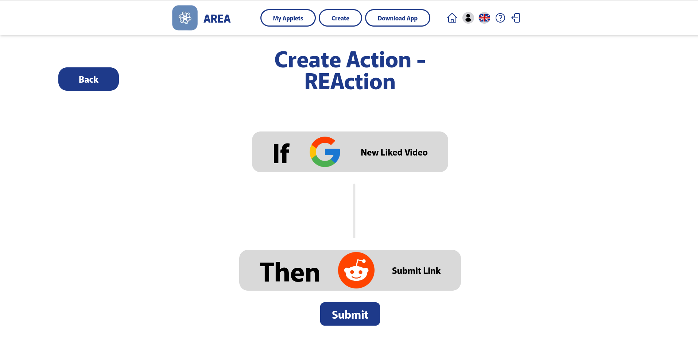
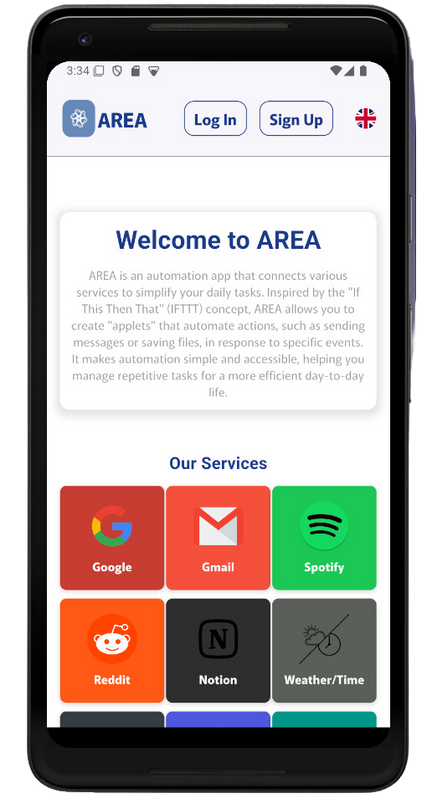
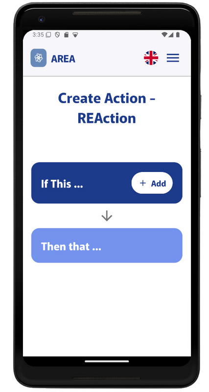
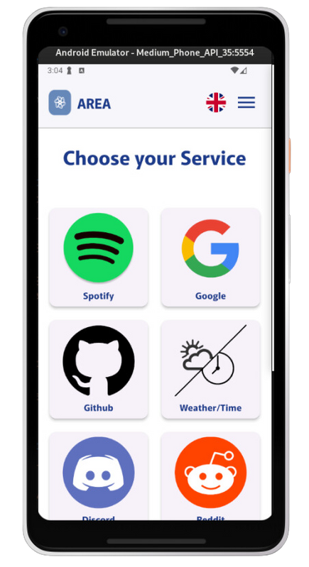
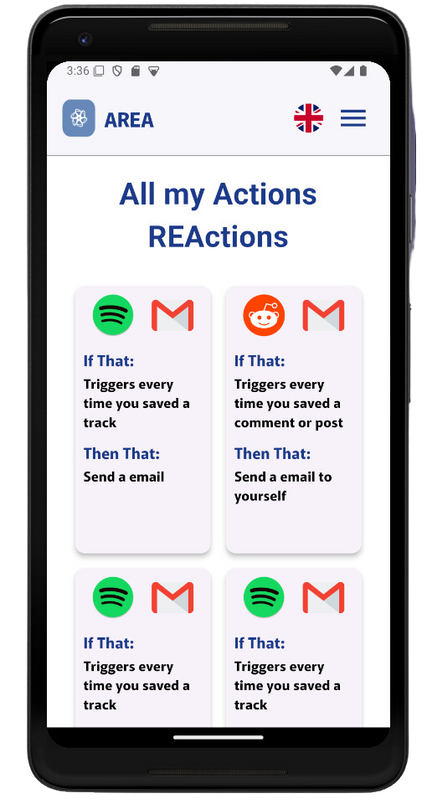

# AREA

## Project overview

The AREA (Action-REAction) project is an automation platform inspired by services like IFTTT and Zapier. This platform allows users to connect various digital services by setting up "Actions" and corresponding "REActions" to automate tasks across platforms. Users can create automated workflows (known as AREA) by connecting a triggering event (Action) to a specified outcome (REAction) between supported services, like Google , Github, Spotify etc.

The project is divided into three main components:

Application Server: Central hub for business logic and service integrations. 
Web Client: Provides a browser-based interface for users to create, manage, and interact with AREA workflows.
Mobile Client: Allows users to interact with the platform on mobile devices, mirroring the functionality of the web client.

## Team responsibilities

### Backend
Sephorah and Baptiste were responsible for developing the application server, handling user management, authentication, service integration, and all core functionalities.

### Mobile client
Yasmine has built the mobile application, ensuring user-friendly interaction with the application server and AREA setup on mobile devices.

### Web client
Ismaïel has worked on the web client, providing users with a responsive and accessible interface to manage their AREAs.

## Preview

### Web










### Mobile










## Set up the project environment
1. Create a .env file at the root, and for each microservice
2. Set the environment variables as in the .env.example, at the root and for each microservice

## Getting Started
Run the docker-compose to start building and running the project.
Do this command:
```
docker compose build && docker compose up
```

Then, you will need to set up ngrok by running the following commands:
```
ngrok config add-authtoken ${NGROK_AUTHTOKEN}
ngrok http --url=communal-engaged-mudfish.ngrok-free.app 8080
```
